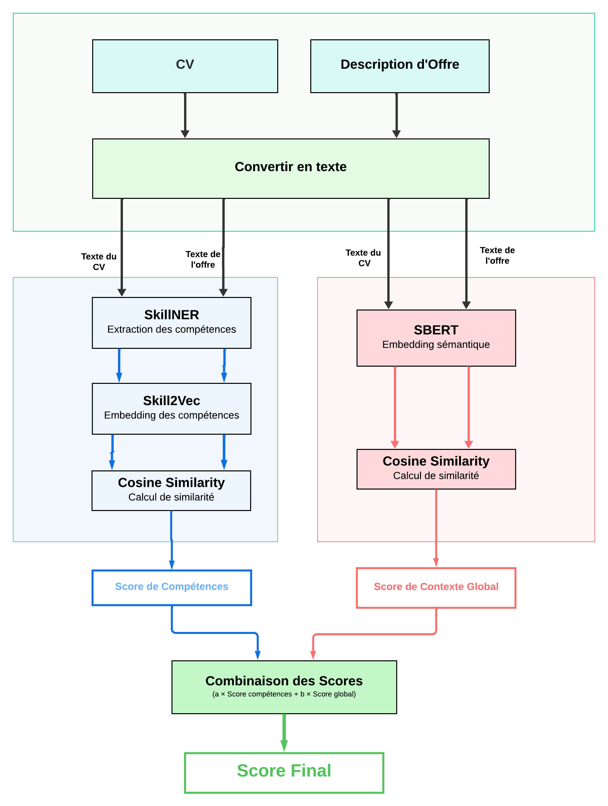

# 🧠 Hybride Matching CV - Offres d’Emploi

Ce projet propose une **approche hybride** intelligente pour le *matching sémantique* entre des **CVs** et des **offres d’emploi**.  
Elle combine deux dimensions complémentaires :

- Une **analyse sémantique globale** des documents grâce à **SBERT** (Sentence-BERT),
- Une **représentation vectorielle fine des compétences** à l’aide de **Skill2Vec**, avec extraction automatique via **SkillNER**.

Cette combinaison permet un appariement plus **pertinent**, **flexible** et **contextuel**, en tenant compte à la fois du sens global et des compétences clés.

---

## 🏗️ Architecture Générale

Voici un aperçu de l’architecture du système :



---

## 🔍 Approche Hybride

L'approche repose sur **trois grandes briques** principales :

### 1. **Extraction des Compétences (SkillNER)**
- Identification automatique des compétences techniques et non techniques à partir de textes bruts.
- Permet d’isoler les compétences des CVs et des offres d’emploi comme base de comparaison vectorielle.

### 2. **Skill2Vec – Représentation Vectorielle des Compétences**
- Modèle de type **Word2Vec** entraîné sur des séquences de compétences extraites.
- Chaque compétence est projetée dans un espace vectoriel sémantique.
- Cela permet de détecter des similarités même en cas de synonymie ou variation de vocabulaire.

### 3. **Matching Sémantique Global (SBERT)**
- Le texte complet du CV et de l’offre d’emploi est encodé via **SBERT**, pour capturer la signification globale.
- Cela complète l’analyse fine par compétences avec une dimension contextuelle plus large.

### ➕ (Optionnel) Matching Symbolique
- Possibilité d’ajouter des règles métier, des pondérations ou du matching exact pour affiner les résultats dans des cas spécifiques.


---


## 📦 Modèle SBERT

Le modèle SBERT permet de capturer la **signification globale** des documents (CVs et offres) pour un **matching contextuel enrichi**.

- Utilise **Sentence-BERT** pour encoder les textes complets.
- Permet de comparer sémantiquement deux documents même en l’absence de mots-clés communs.
- Complète parfaitement l’analyse vectorielle basée sur les compétences.

📄  consultez la documentation pour plus d'info:  
[`Sbert/docs.md`](Sbert/docs.md)

---

### ▶️ Exemple d’Utilisation de SBERT  

Pour utiliser le modèle SBERT, vous pouvez utiliser cette classe `SBERTMatching`:


```python
from Sbert.SBERTMatching import SBERTMatching

# Charger le modèle fine-tuné
sbert_matcher = SBERTMatching(model_path="Sbert/output/sbert_regression_finetuned")

# Comparer un CV avec une offre
cv = "Ingénieur ML expérimenté avec compétences en Python et deep learning."
offre = "Recherche un ingénieur deep learning ayant de l'expérience en Python."

similarite = sbert_matcher.compute_similarity(cv, offre)
print(f"Similarité cosinus : {similarite:.4f}")
```

---

## 📦 Modèle Skill2Vec

Le cœur du système est le Modèle `Skill2VecMatching`, qui encapsule tout le processus d’extraction, vectorisation et matching de compétences.

📄 Pour comprendre son fonctionnement en détail, consultez la documentation :  
[`Skill2Vec/docs.md`](Skill2Vec/docs.md)


---

### ▶️ Exemple d’Utilisation de skill2vec 

Pour utiliser le modèle de compétences (Skill2Vec), vous pouvez utiliser cette classe `Skill2VecMatching`:

```python

from Skill2Vec.Skill2VecMatching import Skill2VecMatching

# Instanciation du module avec les fichiers CV et offre d’emploi
competence_model = Skill2VecMatching(model_path=r"Skill2Vec/models/skill2vec_10k_trained.model") 

# Obtention du score de similarité
score = competence_model.get_similarity_score(cv_input="test_data/cv.txt",job_input="test_data/job.txt")

print(f"Score de similarité : {score}")

```

## 🤖 Exemple d’Utilisation de l’Approche Hybride

Voici un exemple de scénario complet combinant **SBERT (matching global)** et **Skill2Vec (matching de compétences)**, avec une **pondération** personnalisée pour équilibrer les deux scores :

```python
from sbert_matcher import SBERTMatching
from Skill2VecMatching import Skill2VecMatching

# Charger les modèles
sbert_matcher = SBERTMatching(model_path="Sbert/output/sbert_regression_finetuned")
skill2vec_matcher = Skill2VecMatching(model_path=r"Skill2Vec/models/skill2vec_10k_trained.model") 

# Calcul des scores
score_sbert = sbert_matcher.compute_similarity("cv.pdf", "job.txt")
score_skill2vec = skill2vec_matcher.get_similarity_score()

# Pondération des deux scores (ex. 60% SBERT, 40% Skill2Vec)
final_score = 0.6 * score_sbert + 0.4 * score_skill2vec

print(f"Score SBERT : {score_sbert:.4f}")
print(f"Score Skill2Vec : {score_skill2vec:.4f}")
print(f"Score Final Pondéré : {final_score:.4f}")

```


📘 Pour plus d'exemples d'utilisation du modèle, veuillez consulter le notebook [`exemple.ipynb`](exemple.ipynb).


---

Nous prévoyons d'intégrer cette **approche hybride de matching sémantique** (basée sur **SBERT** et **Skill2Vec**) dans notre **plateforme de recrutement** afin d'améliorer la pertinence de la mise en relation entre les CV et les offres d'emploi.

➡️ **Les détails techniques et les implémentations complètes seront disponibles prochainement** dans ce dépôt GitHub : [Lien à venir](#)

📌 Restez connectés pour découvrir comment cette méthode permet de combiner la puissance des embeddings contextuels (SBERT) avec la similarité sémantique orientée compétences (Skill2Vec).

Rédigé par : [Mohamed OUABBI](https://github.com/mouabbi)
--- 