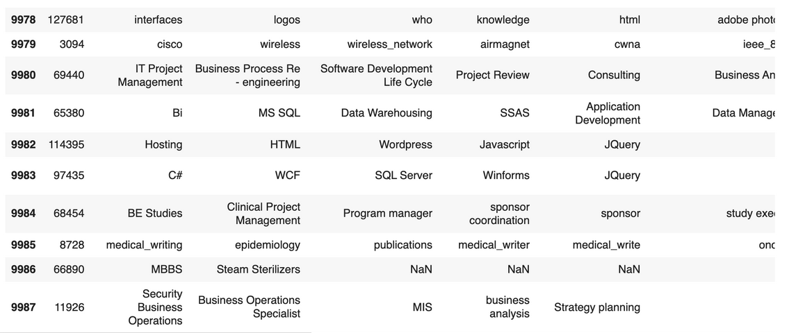

# 🛠️  Modèle de Compétence Skill2Vec 

Ce module est la **seconde brique** de notre système hybride de matching entre **CV** et **offres d’emploi**.  
Il s’appuie sur une représentation vectorielle des compétences (`Skill2Vec`) pour calculer une **similarité métier** entre deux documents.

---

## 🔄 Processus global

Le pipeline `Skill2Vec` suit les étapes suivantes :

1. **Charger les documents** (CV ou Offres d'emploi) au format `.pdf`, `.docx`, ou `.txt`
2. **Convertir les documents en texte brut**
3. **Extraire automatiquement les compétences** grâce à `SkillNER`
4. **Calculer les vecteurs des compétences extraites** avec `Skill2Vec`
5. **Retourner un score de similarité** entre le CV et l'offre

---

## 🔹 Étape 1 : Chargement & Conversion des documents en texte brut

Dans cette première étape, nous allons convertir les documents (CV ou Offres d'emploi) en texte brut.  
Le format original peut être `.pdf`, `.docx`, ou `.txt`.

Nous utilisons pour cela la fonction `convert_to_text()` définie dans `utils/convert_to_text.py`,  
qui s'appuie sur :

- [`pdfminer`](https://pypi.org/project/pdfminer.six/) pour l'extraction de texte à partir de fichiers PDF
- [`python-docx`](https://pypi.org/project/python-docx/) pour les fichiers Word (`.docx`)
- Une lecture simple pour les fichiers `.txt`

```python
from utils.convert_to_text import convert_to_text

text_cv = convert_to_text("examples/cv_exemple.pdf")
text_job = convert_to_text("examples/offre_exemple.docx")
```
> 📌 **Remarque** : Assurez-vous d'avoir installé les dépendances :
>
> ```bash
> pip install pdfminer.six python-docx
> ```

---


## 🔹 Étape 2 : Extraction des compétences grâce à `SkillNER`

Dans cette étape, nous allons extraire automatiquement les compétences à partir du texte brut du CV ou de l'offre d'emploi en utilisant **SkillNER**.  
**SkillNER** est un outil d'extraction de compétences qui analyse le texte et identifie les compétences techniques et non techniques présentes dans le document.

**SkillNER** est un modèle d'extraction de compétences conçu pour identifier et extraire des compétences spécifiques à partir de texte brut, telles que des langages de programmation, des outils, des technologies, ainsi que des compétences non techniques comme la gestion de projet, la communication, et plus encore.

**SkillNER** fonctionne en se basant sur une base de données de compétences (nommée **SKILL_DB**), qui contient une large gamme de compétences réparties en différentes catégories, telles que techniques, business, etc. Cette base de données permet à SkillNER de reconnaître et d'extraire les compétences pertinentes dans le texte fourni.

De plus, **SkillNER** est flexible et permet d'utiliser votre propre dataset personnalisé. Vous pouvez intégrer vos propres compétences à la base de données afin de mieux correspondre à vos besoins spécifiques, que ce soit pour un domaine particulier ou une entreprise avec des exigences précises en termes de compétences.

> 🔗 Pour en savoir plus sur **SkillNER**, visitez le site : [https://skillner.vercel.app/](https://skillner.vercel.app/)  
> 📦 Ou consultez le dépôt GitHub : [https://github.com/AnasAito/SkillNER/](https://github.com/AnasAito/SkillNER/)


### Fonctionnement de l'extraction

La fonction `extract_skills()` définie dans `utils/extract_skills.py` prend en entrée un texte brut (par exemple, le contenu d'un CV ou d'une offre d'emploi) et retourne une liste d'objets représentant les compétences extraites. Chaque objet contient les informations suivantes :

- **skill_name** : le nom de la compétence (ex. `React JS`, `Node JS`)
- **skill_type** : le type de compétence (ex. `HARD SKILL` ou `SOFT SKILL`)
- **match_type** : le type de correspondance (ex. `full_matches` pour une correspondance exacte)
- **score** : la précision de la correspondance (valeur entre 0 et 1)

### Exemple d'utilisation

```python
from utils.extract_skills import extract_skills

# Exemple de texte CV
text_cv = """
Mohamed Ouabbi, développeur full stack web avec 2 ans d'expérience. Compétences : React JS, Node JS, MongoDB, Express JS, JavaScript, HTML5, CSS3.
"""

# Extraire les compétences
skills = extract_skills(text_cv)

# Affichage des compétences extraites
for skill in skills:
    print(f"Skill: {skill['skill_name']}, Type: {skill['skill_type']}, Match Type: {skill['match_type']}, Score: {skill['score']}")
```
### Exemple de sortie

- **Skill**: node js, **Type**: HARD SKILL, **Match Type**: full_matches, **Score**: 1
- **Skill**: react js, **Type**: HARD SKILL, **Match Type**: full_matches, **Score**: 1
- **Skill**: express js, **Type**: HARD SKILL, **Match Type**: full_matches, **Score**: 1
- **Skill**: e commerce, **Type**: HARD SKILL, **Match Type**: N-Gram, **Score**: 1

---

### Remarque

- SkillNER est conçu pour extraire aussi bien des compétences techniques (comme les langages de programmation et les outils) que des compétences non techniques (comme la gestion de projet, la communication, etc.).
- Les compétences extraites peuvent être utilisées pour effectuer des comparaisons de similarité avec les compétences des offres d'emploi dans l'étape suivante du pipeline.


---

## 🔹 Étape 3 : Entraînement de `Skill2Vec`

Dans cette étape, nous allons **entraîner notre modèle Skill2Vec**, une représentation vectorielle des compétences permettant de mesurer la **similarité sémantique entre compétences** extraites d’un CV et d’une offre d’emploi.

### 📌 Objectif

Le but de Skill2Vec est de **projeter les compétences dans un espace vectoriel commun**, afin de :
- Capturer les relations sémantiques entre compétences (ex: `deep learning` proche de `machine learning`)
- Faciliter la comparaison entre deux documents basés uniquement sur leurs compétences.

---

### 🧠 Qu’est-ce que Skill2Vec ?

Skill2Vec est un modèle **Word2Vec spécialisé**, entraîné **non pas sur du texte brut**, mais sur des **listes de compétences extraites de CVs et d'offres d’emploi**.

> Il repose sur la même architecture que Word2Vec : `Skip-gram` ou `CBOW`, et s’entraîne via la librairie [Gensim](https://radimrehurek.com/gensim/).

- **Entrée** : des séquences de compétences (par document)
- **Sortie** : un vecteur dense pour chaque compétence

---

### 📊 Jeu de Données : Skill2Vec Dataset

Nous allons entraîner notre modèle sur le dataset **Skill2Vec**, disponible sur [https://paperswithcode.com/dataset/skill2vec](https://paperswithcode.com/dataset/skill2vec) et accessible via GitHub :

🔗 **Repository GitHub** : [https://github.com/duyet/skill2vec-dataset](https://github.com/duyet/skill2vec-dataset)


---

### 🗂️ Nom

- **skill2vec-dataset**

Le repository propose plusieurs versions :
- `skill2vec_1k.csv` → 1 000 lignes  
- `skill2vec_10k.csv` → 10 000 lignes  
- `skill2vec_50k.csv` → 50 000 lignes  

Ces fichiers représentent des échantillons du dataset complet, utiles pour les phases de prototypage ou de test rapide.


---

### 🌐 Source

- Les données sont collectées à partir de **descriptions de postes** publiées sur [Dice.com](https://www.dice.com), un site d'emploi technique majeur aux États-Unis.


---

### 📦 Taille

- Le jeu de données complet contient **plus de 1,4 million de descriptions de postes**.
- Taille approximative : **5 Go**.


---

### 📝 Format

Chaque ligne du fichier est composée de :
- Un **identifiant de poste**
- Une **liste de compétences associées**, séparées par des virgules

---

#### Exemple de ligne :

Voici un aperçu du format du fichier (chaque ligne = un poste + compétences) :



> 📌 *Assurez-vous que l'image `format.png` est placée dans le même répertoire que votre fichier 

Le processus d'entraînement du modèle est détaillé dans le notebook [`skill2vec_train.ipynb`](skill2vec_train.ipynb), où nous utilisons Word2Vec pour apprendre des représentations vectorielles des compétences à partir du dataset Skill2Vec.

---


## 🔹 Étape 4 : Calcul du Score de Similarité avec `skill2vec`

Dans cette étape, nous allons **calculer le score de similarité** entre les compétences extraites de CVs et d'offres d’emploi, en utilisant notre modèle **Skill2Vec** entraîné. Cela nous permettra de comparer les compétences et d’évaluer à quel point elles sont proches les unes des autres dans l’espace vectoriel.

### 📌 Objectif

Le but est de :
- **Mesurer la similarité** entre deux listes de compétences (par exemple, celles d'un CV et celles d'une offre d'emploi).
- **Obtenir un score de similarité** qui reflète la proximité sémantique entre ces compétences, ce qui permet d’évaluer la pertinence d’une offre pour un candidat ou vice-versa.

---

### 🧠 Comment Calculer le Score de Similarité ?

Le calcul de la similarité entre deux ensembles de compétences peut être effectué à l'aide de la **similarité cosinus**, une mesure qui évalue la distance entre deux vecteurs dans l’espace vectoriel.

Voici les principales étapes :

1. **Obtention des Vecteurs des Compétences** : 
   - Pour chaque compétence d'un ensemble, nous récupérons le vecteur dense associé à partir du modèle Skill2Vec.
   
2. **Calcul du Vecteur Moyen pour le Skillset** : 
   - Nous calculons la moyenne des vecteurs de toutes les compétences d’un ensemble pour obtenir un vecteur global représentant le skillset (ensemble de compétences).
   
3. **Calcul de la Similarité Cosinus** : 
   - Enfin, nous calculons la **similarité cosinus** entre les deux vecteurs moyens des skillsets, ce qui nous donne un score entre -1 et 1, où 1 signifie une similarité maximale et -1 une dissimilarité totale.

---

### 💻 Exemple d'Utilisation

```python
# Liste des compétences extraites du CV et de l'offre d'emploi
skills_cv = ['python', 'machine learning', 'data analysis']
skills_job_offer = ['python', 'deep learning', 'data science']

# Calcul du score de similarité entre les deux skillsets
similarity_score = skillset_similarity(skills_cv, skills_job_offer, model)
print(f"Le score de similarité entre le CV et l'offre est : {similarity_score}")
```

---

L’ensemble du processus est implémenté dans le notebook suivant :

🔗 **Notebook complet** : [`cv_job_matching_pipeline.ipynb`](cv_job_matching_pipeline.ipynb)


---

# Utilisation de la classe Skill2VecMatching

Nous avons encapsulé toute la logique dans une classe appelée `Skill2VecMatching`, qui prend en entrée un CV et une offre d'emploi (sous forme de texte brut ou de chemin de fichier), ainsi qu’un modèle pré-entraîné (par défaut : `skiLL2vec`). 

Une fois instanciée, il suffit simplement d’appeler la méthode `get_similarity_score()` pour obtenir un score de similarité entre les compétences extraites.

### Exemple d’utilisation :

```python
from Skill2VecMatching import Skill2VecMatching

# Instanciation du module avec les fichiers CV et offre d’emploi
competence_module = Skill2VecMatching("test_data/cv.txt", "test_data/job.txt")

# Obtention du score de similarité
score = competence_module.get_similarity_score()
```

> ✅ Vous pouvez donc directement utiliser la classe et sa méthode sans avoir à gérer les détails internes de traitement ou d’extraction.


Rédigé par : [Mohamed OUABBI](https://github.com/mouabbi)

--- 